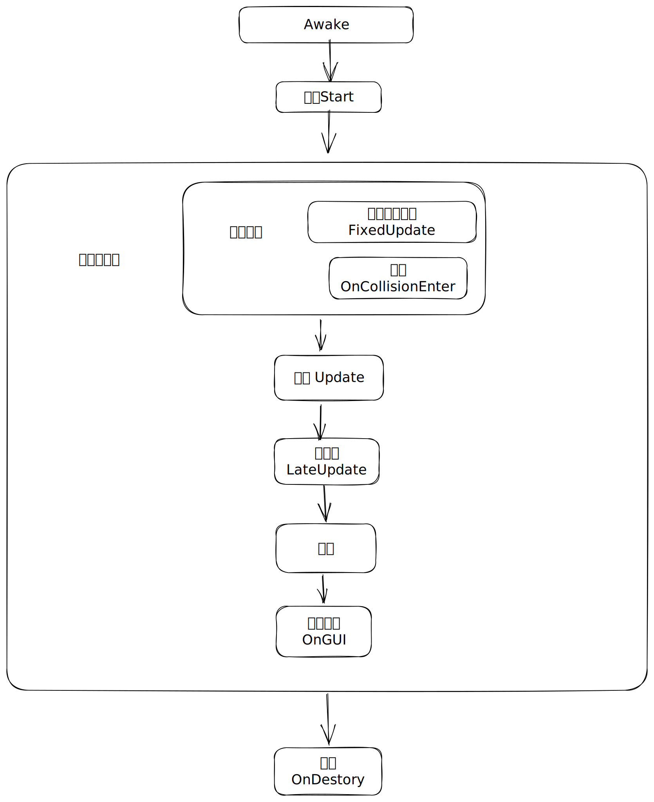

# 🦊 2.3 脚本的生命周期

## 常用的脚本事件

## 常见的事件方法

| 事件                         | 说明                        |
| -------------------------- | ------------------------- |
| Awake                      | 脚本加载后调用，时机早于Start         |
| Start                      | 脚本可用的第一帧，正好在第一次Update之前调用 |
| Update                     | 每帧调用                      |
| LateUpdate                 | 每帧调用，保证在所有Update执行过后才执行   |
| FixedUpdate                | 物理更新，会尽可能确保调用频率           |
| OnCollisionEnter           | 碰撞开始事件                    |
| OnollisionStay             | 碰撞持续中                     |
| OnCollisionExit            | 结束碰撞事件，即碰撞体相互离开           |
| OnTriggerEnter             | 触发器开始事件                   |
| OnTriggerStay              | 触发持续中                     |
| OnTriggerExit              | 触发结束事件                    |
| OnCollisionEnter2D         | 2D                        |
| OnollisionStay2D           | 2D                        |
| OnCollisionExit2D          | 2D                        |
| OnTriggerEnter2D           | 2D                        |
| OnTriggerStay2D            | 2D                        |
| OnTriggerExit2D            | 2D                        |
| OnParticleCollision        | 粒子碰撞事件，Unity的粒子系统也支持物理特性  |
| OnParticleSystemStopped    | 粒子系统结束                    |
| OnparticleTrigger          | 粒子触发器事件                   |
| OnGUI                      | 渲染与处理GUI事件时调用             |
| OnEnable                   | 物体被激活时调用                  |
| OnDisable                  | 物体被禁用时调用                  |
| OnDestory                  | 销毁组件时调用                   |
| OnPreRender                | 即将渲染事件，某个摄像机开始渲染前调用       |
| OnRenderObject             | 渲染事件，某个摄像机渲染场景时调用         |
| OnPostRender               | 渲染后事件，某个摄像机结束渲染时调用        |
| OnWillRenderObject         | 每个摄像机渲染非UI的可见物体时调用        |
| OnPreCull                  | 摄像机进行可见性裁剪之前调用            |
| OnTransformChildrenChanged | 物体的子物体发生变化时调用             |
| OnTransformParentChanged   | 物体的父物体发生变化时调用             |
| OnApplicationFocus         | Game窗口失去焦点或获得焦点时调用        |
| OnApplicationPause         | 游戏被暂停时调用                  |
| OnApplicationQuit          | 游戏退出时调用                   |
| OnBecomeVisible            | 物体变得可见时调用                 |
| OnBecomeInvisible          | 物体变得不可见时调用                |
| OnMouseDown                | 鼠标在UI元素或碰撞体上按下时调用         |
| OnMouseDrag                | 鼠标在UI元素或碰撞体上持续按下时调用       |
| OnMouseEnter               | 鼠标进入UI元素或碰撞体范围时调用         |
| OnMouseExit                | 鼠标离开UI元素或碰撞体范围时调用         |
| OnMouseOver                | 鼠标在UI元素或碰撞体范围内时，每帧调用      |
| OnMouseUp                  | 用户放开鼠标按键时调用               |
| OnMouseUpAsButton          | 用户在同一个UI元素或碰撞体上，松开鼠标按键时调用 |

